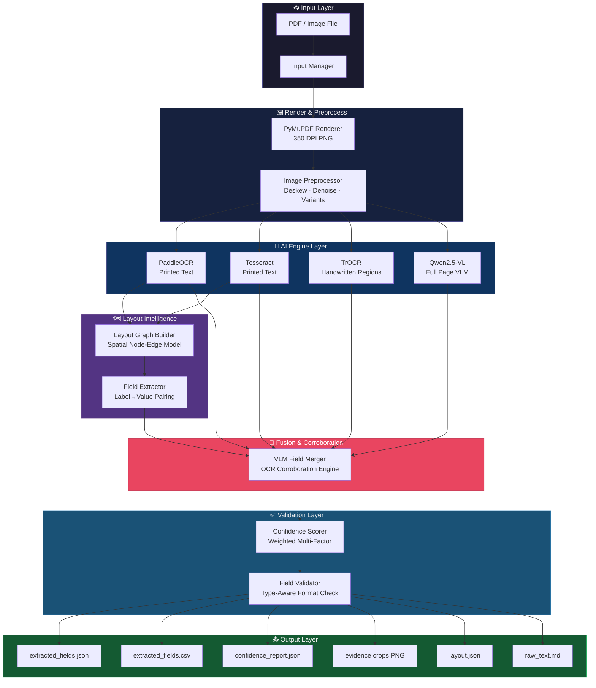
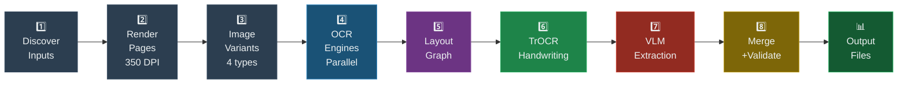
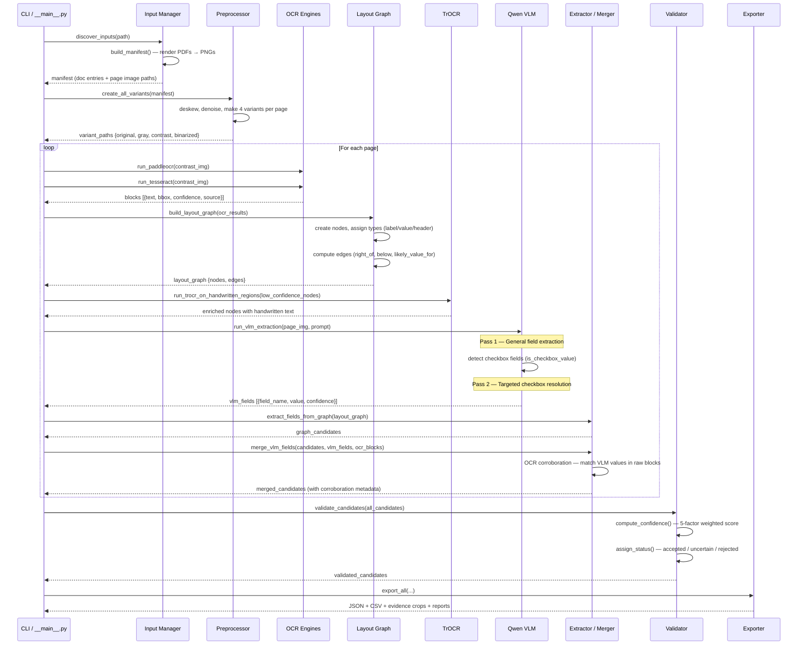
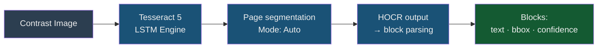
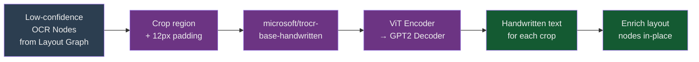
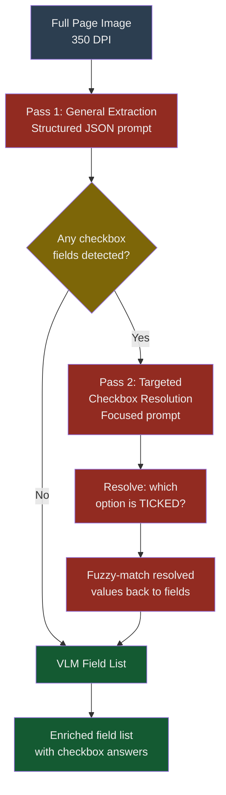
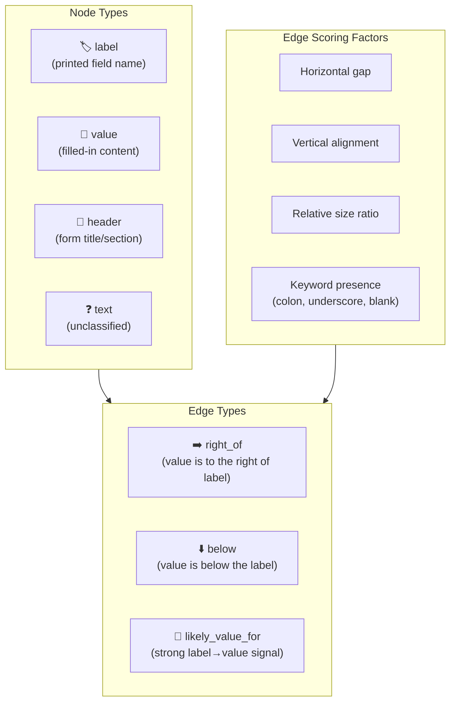
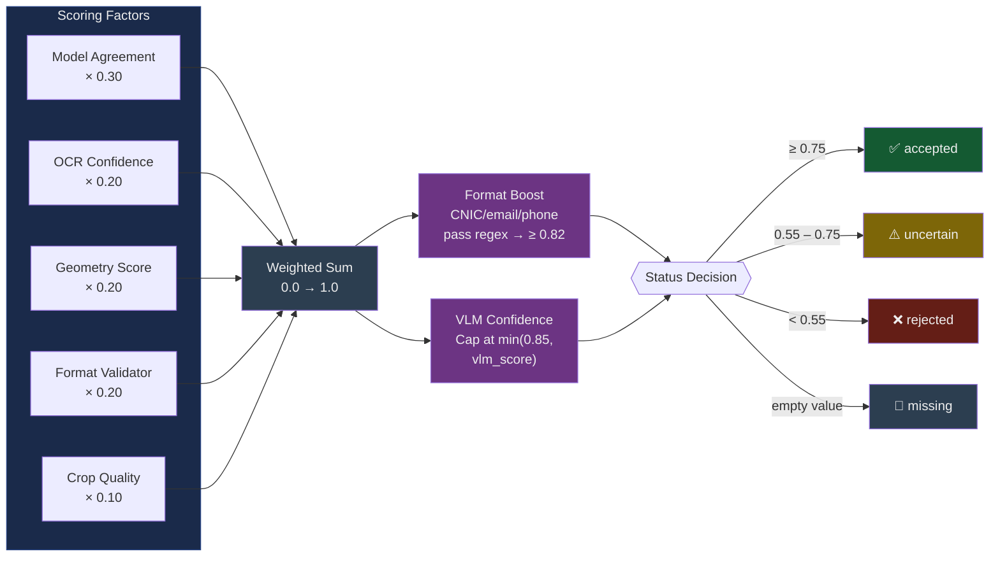
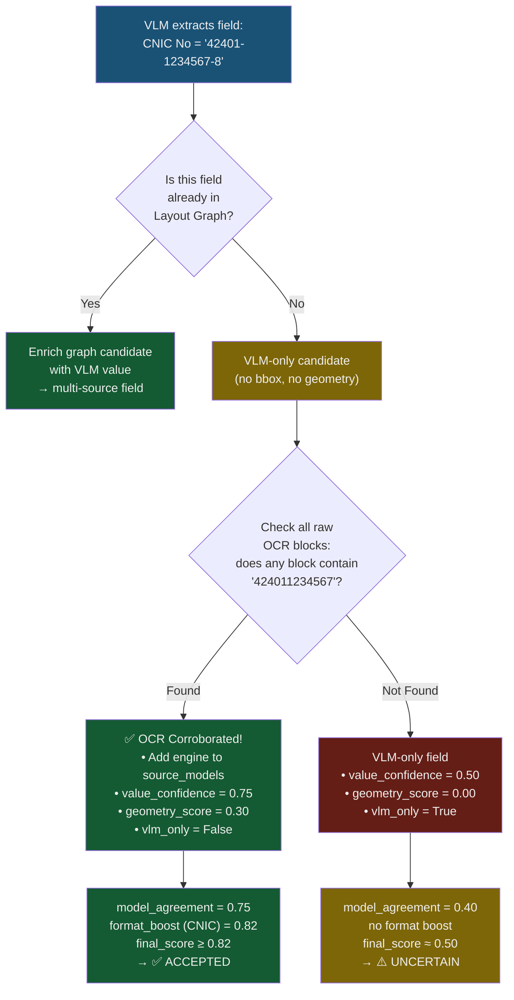

<](https://python.org)
[](https://github.com/PaddlePaddle/PaddleOCR)
[](https://github.com/tesseract-ocr/tesseract)
[](https://huggingface.co/microsoft/trocr-base-handwritten)
[](https://ollama.com)
[](LICENSE)

---

*Extracts every filled field — typed, handwritten, or checkbox — from complex scanned PDFs using a layered ensemble of OCR and Vision-Language Models.*

</div>

---

## 📋 Table of Contents

- [Overview](#-overview)
- [Key Features](#-key-features)
- [System Architecture](#-system-architecture)
- [Pipeline Flow](#-pipeline-flow)
- [Engine Deep Dive](#-engine-deep-dive)
- [Confidence & Validation System](#-confidence--validation-system)
- [Output Schema](#-output-schema)
- [Project Structure](#-project-structure)
- [Installation](#-installation)
- [Usage](#-usage)
- [Configuration](#-configuration)
- [How Corroboration Works](#-how-corroboration-works)
- [Performance Notes](#-performance-notes)

---

## 🌟 Overview

This pipeline was built to solve a real-world problem: **bank account opening forms** (AOFs) are scanned PDFs containing a mix of printed labels, handwritten values, checkboxes, and Urdu/English bilingual text. Traditional single-engine OCR fails because:

- Handwriting needs a dedicated model (TrOCR)
- Checkboxes need visual understanding (VLM)
- Layout relationships (label → value) need spatial reasoning (Layout Graph)
- Any single engine produces errors that need cross-validation

This system solves all of these with a **4-layer ensemble** that fuses evidence from multiple AI models before making a final decision on each field.

---

## ✨ Key Features

| Feature | Description |
|---|---|
| 🏗️ **Multi-Engine Fusion** | PaddleOCR + Tesseract + TrOCR + Qwen VLM work in ensemble |
| 🧠 **Layout Graph** | Spatial reasoning to pair labels with their values |
| ✍️ **Handwriting Support** | Dedicated TrOCR model for handwritten text regions |
| ☑️ **Checkbox Detection** | Two-pass VLM strategy to identify checked options |
| 🔗 **OCR Corroboration** | VLM values cross-validated against raw OCR blocks |
| 📊 **Confidence Scoring** | Weighted multi-factor scoring per field |
| 📁 **Rich Outputs** | JSON, CSV, evidence crops, layout graph, raw text |
| ⚙️ **YAML Config** | All thresholds, models, and engines fully configurable |
| 🌐 **Bilingual** | Handles English + Urdu labels; translates to English |

---

## 🏛️ System Architecture

The system is composed of 6 major subsystems:



---

## 🔄 Pipeline Flow

Every document is processed through these 8 ordered steps:



### Step-by-Step Breakdown



---

## 🔬 Engine Deep Dive

### 1. PaddleOCR — Printed Text Detection


- **Best at**: Dense printed text, form labels, typed numbers
- **Input variant**: Contrast-enhanced image
- **Output**: Up to 160+ text blocks per page with bounding boxes

---

### 2. Tesseract — Secondary Printed Text



- **Best at**: Cross-validation of PaddleOCR results, edge cases
- **Provides**: Independent confirmation for higher model agreement scores

---

### 3. TrOCR — Handwritten Text



- **Trigger**: Nodes with `confidence < 0.85` that are classified as `value` or `text`
- **Model**: `microsoft/trocr-base-handwritten` via HuggingFace Transformers
- **Processes**: 30–160 handwritten crops per page

---

### 4. Qwen2.5-VL — Vision Language Model (Authoritative)



The VLM is the **authoritative** model — when it returns ≥ 3 valid fields, it acts as a filter to suppress noisy graph-only candidates.

**Two-pass checkbox strategy:**
1. **Pass 1** — General extraction with the full structured prompt
2. **Pass 2** — Targeted resolution: asks *"for these specific checkbox fields, which option has a tick mark?"*

---

## 🗺️ Layout Graph

The **Layout Graph** is the spatial intelligence layer. It converts raw OCR blocks into a structured graph of labeled nodes and directional edges, enabling label→value pairing.



**How nodes are classified:**
- **`label`**: Short text ending in `:`, or containing known form keywords (`name`, `date`, `cnic`, etc.)
- **`value`**: Text adjacent to a label with geometric relationship
- **`header`**: All-caps long strings, form/product titles

---

## ✅ Confidence & Validation System

Every extracted field receives a **final confidence score** computed from 5 independent factors:



### Model Agreement Score

| Condition | Score |
|---|---|
| 3+ models agree | 0.80 – 0.95 |
| OCR + VLM exact match | 0.95 |
| OCR + VLM partial match | 0.60 |
| VLM + OCR corroborated | **0.75** |
| Single model only | 0.40 |
| No model | 0.00 |

### Format Validators

| Field Type | Validation Logic | Score |
|---|---|---|
| `national_id` | 13-digit CNIC pattern | 0.95 |
| `email` | `x@y.z` regex | 0.95 |
| `phone` | 7–15 digits | 0.90 |
| `date` | `DD/MM/YYYY` patterns | 0.90 |
| `account_number` | 8–20 digits | 0.90 |
| `person_name` | Alpha-only, 2–80 chars | 0.85 |
| `checkbox` | Known option words | 0.95 |
| `text` (default) | Non-empty | 0.60 |

---

## 🔗 How Corroboration Works

One of the most important innovations in this pipeline is **OCR Corroboration** — a mechanism to upgrade VLM-only fields when their values can be verified in raw OCR output.



**Matching logic** (in `extractor.py`):
1. Normalize both the VLM value and OCR block text by stripping spaces, dashes, and dots
2. Check for direct substring containment
3. For values ≥ 6 chars, allow ≥ 75% length-overlap partial matching (handles minor OCR typos)

---

## 📦 Output Schema

Each processed document produces a folder under `data/output/<doc_id>/`:

```
data/output/
└── aof02_07c208ce/
    ├── extracted_fields.json     ← Main structured output
    ├── extracted_fields.csv      ← Spreadsheet-friendly version
    ├── confidence_report.json    ← Per-field quality warnings
    ├── layout.json               ← Full spatial graph (nodes + edges)
    ├── raw_text.md               ← All OCR text by page
    └── evidence/
        ├── page_0001_branch_cand_0000.png
        ├── page_0001_cnic_no_cand_0003.png
        └── ...                   ← Cropped image evidence per field
```

### `extracted_fields.json` example

```json
{
  "document_id": "aof02_07c208ce",
  "source_file": "AOF02.pdf",
  "overall_status": "accepted_with_uncertainties",
  "overall_confidence": 0.821,
  "fields": [
    {
      "field_name": "branch",
      "display_name": "Branch",
      "value": "3503",
      "field_type": "text",
      "status": "accepted",
      "confidence": 0.759,
      "source_models": ["paddleocr", "trocr_handwritten", "qwen_vl"],
      "uncertainty_reason": null
    },
    {
      "field_name": "cnic_no",
      "display_name": "CNIC No.",
      "value": "42401-1234567-8",
      "field_type": "national_id",
      "status": "accepted",
      "confidence": 0.820,
      "source_models": ["qwen_vl", "paddleocr"],
      "uncertainty_reason": null
    }
  ]
}
```

---

## 📁 Project Structure

```
OCR/
│
├── src/ocr_extract/             ← Main package
│   ├── __main__.py              ← CLI entry point & pipeline orchestration
│   ├── __init__.py              ← Package version
│   ├── config.py                ← Dataclass-based config loader
│   ├── input_manager.py         ← PDF discovery, rendering, manifest builder
│   ├── preprocessor.py          ← Image deskew, denoise, variant creation
│   ├── layout_graph.py          ← Spatial graph: nodes, edges, scoring
│   ├── extractor.py             ← Field extraction + OCR corroboration merger
│   ├── validator.py             ← Confidence scoring, status assignment
│   ├── exporter.py              ← JSON/CSV/evidence crop writer
│   └── engines/
│       ├── __init__.py
│       ├── paddleocr_engine.py  ← PaddleOCR wrapper
│       ├── tesseract_engine.py  ← Tesseract wrapper
│       ├── trocr_engine.py      ← TrOCR (handwritten) wrapper
│       └── vlm_engine.py        ← Qwen2.5-VL via Ollama (2-pass)
│
├── configs/
│   └── default.yaml             ← All pipeline settings
│
├── data/                        ← (git-ignored) output folder
├── work/                        ← (git-ignored) temp crops & renders
├── logs/                        ← (git-ignored) pipeline.log
│
├── requirements.txt
├── test_render.py
│
├── OCR_ARCHITECTURE.md
├── OCR_EXTRACTION_SCHEMA.md
├── OCR_IMPLEMENTATION_PLAN.md
├── OCR_MODEL_EVALUATION.md
├── OCR_PIPELINE.md
├── OCR_RUNBOOK.md
├── OCR_SETUP.md
└── OCR_VALIDATION.md
```

---

## ⚙️ Installation

### Prerequisites

| Requirement | Notes |
|---|---|
| Python 3.10+ | Tested on 3.10 and 3.11 |
| Tesseract 5.x | Must be on `PATH` |
| Ollama | For Qwen VLM — [install here](https://ollama.com) |
| CUDA (optional) | GPU speeds up PaddleOCR & TrOCR significantly |

### 1. Clone the repo

```bash
git clone https://github.com/MuhammadAhmed43/Text-subtraction.git
cd Text-subtraction
```

### 2. Create a virtual environment

```bash
python -m venv venv
# Windows
venv\Scripts\activate
# Linux / macOS
source venv/bin/activate
```

### 3. Install Python dependencies

```bash
pip install -r requirements.txt
```

### 4. Install Tesseract

- **Windows**: Download from [UB-Mannheim](https://github.com/UB-Mannheim/tesseract/wiki) and add to PATH
- **Linux**: `sudo apt install tesseract-ocr`
- **macOS**: `brew install tesseract`

### 5. Pull the Qwen VLM model via Ollama

```bash
# Install Ollama from https://ollama.com first, then:
ollama pull qwen2.5vl:3b
```

> **Note**: The `3b` model runs on CPU with ~8GB RAM. For better accuracy use `7b` (requires ~16GB RAM or GPU).

---

## 🚀 Usage

### Basic run (interactive prompt)

```bash
python -m src.ocr_extract run
# > Please enter the input file or directory path: AOF02.pdf
```

### Run with explicit input

```bash
python -m src.ocr_extract run --input AOF02.pdf
```

### Run on a folder of PDFs

```bash
python -m src.ocr_extract run --input ./forms/ --output ./results/
```

### Verbose mode (debug logging)

```bash
python -m src.ocr_extract run --input AOF02.pdf --verbose
```

### Custom config

```bash
python -m src.ocr_extract run --input AOF02.pdf --config configs/fast.yaml
```

### Terminal output example

```
OCR Extraction Pipeline v0.1.0
Input: C:\...\AOF02.pdf
Output: C:\...\data\output

Found 1 document(s)
Rendering pages... 0:00:02
Rendered 1 page(s) across 1 document(s)
Creating image variants...

─────────────────────────────────────────────
Processing: AOF02.pdf (doc_id=aof02_07c208ce)
─────────────────────────────────────────────
-- Page 1 --
PaddleOCR: 166 blocks in 11.7s
Tesseract:  80 blocks in 2.1s
TrOCR: processed 70 handwritten crops
VLM: 17 fields in 29.7s

✅ AOF02.pdf: 14 accepted, 3 uncertain, 0 rejected, 0 missing (65.3s)

┌─────────────────────────────┬──────────────────────┬──────────┬────────────┐
│ Field                       │ Value                │ Status   │ Confidence │
├─────────────────────────────┼──────────────────────┼──────────┼────────────┤
│ Branch                      │ 3503                 │ accepted │       0.76 │
│ Account Title               │ Muhammad Shehzad Roy │ accepted │       0.82 │
│ CNIC No.                    │ 42401-1234567-8      │ accepted │       0.82 │
│ Date of Birth               │ 01-01-1999           │ accepted │       0.82 │
│ Primary Contact Number      │ 0312-1245789         │ accepted │       0.82 │
│ Email Address               │ abc@gmail.com        │ accepted │       0.82 │
│ ATM/Debit Card Scheme       │ Paypak               │ accepted │       0.87 │
│ Card Type                   │ Classic              │ accepted │       0.87 │
└─────────────────────────────┴──────────────────────┴──────────┴────────────┘
```

---

## ⚙️ Configuration

All settings live in `configs/default.yaml`:

```yaml
render:
  dpi: 350              # Higher = better OCR, slower rendering
  image_format: png

preprocess:
  enable_deskew: true   # Correct skewed/rotated scans
  enable_denoise: true  # Reduce noise before OCR
  variants:
    - original
    - gray
    - contrast          # Used by PaddleOCR + Tesseract
    - binarized

ocr:
  engines:
    - paddleocr
    - tesseract
    - trocr_handwritten
    - qwen_vl
  trocr_model: "microsoft/trocr-base-handwritten"
  vlm_model: "qwen2.5vl:3b"   # Change to 7b for better accuracy
  paddle_lang: "en"
  tesseract_lang: "eng"

validation:
  accept_threshold: 0.75     # Score ≥ this → accepted
  uncertain_threshold: 0.55  # Score ≥ this → uncertain
  rerun_threshold: 0.70
  max_retries: 2

outputs:
  save_evidence_crops: true
  save_raw_model_outputs: true
```

### Disabling engines for speed

Edit `configs/default.yaml` to remove engines:

```yaml
ocr:
  engines:
    - paddleocr    # Keep for printed text
    - qwen_vl      # Keep for structure + checkboxes
    # Remove tesseract and trocr_handwritten for ~3x speedup
```

---

## 📊 Performance Notes

| Configuration | Approx. Time / Page | Accuracy |
|---|---|---|
| All 4 engines | 60–120s | ⭐⭐⭐⭐⭐ |
| PaddleOCR + VLM only | 20–40s | ⭐⭐⭐⭐ |
| PaddleOCR + Tesseract (no VLM) | 3–8s | ⭐⭐⭐ (no handwriting/checkbox) |
| GPU (CUDA) + all engines | 15–30s | ⭐⭐⭐⭐⭐ |

> Timing measured on an Intel Core i7 CPU with no GPU. The VLM step (Qwen2.5-VL via Ollama) is the largest bottleneck on CPU.

---

## 🤝 Contributing

1. Fork the repository
2. Create a feature branch: `git checkout -b feature/my-improvement`
3. Commit your changes: `git commit -m 'Add: my improvement'`
4. Push to the branch: `git push origin feature/my-improvement`
5. Open a Pull Request

---

## 📄 License

This project is licensed under the MIT License. See [LICENSE](LICENSE) for details.

---

<div align="center">

Built with ❤️ using PaddleOCR · Tesseract · TrOCR · Qwen2.5-VL · PyMuPDF

</div>
]]>
